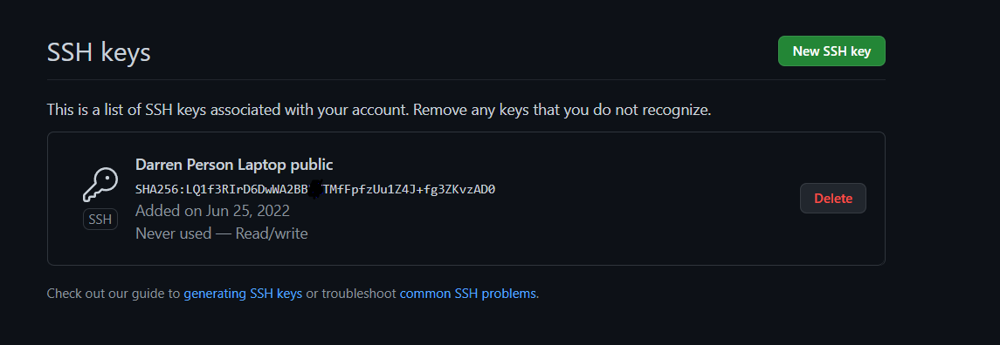

# Installion Instructions

### Install the following programs
-[VSCode](https://code.visualstudio.com/)
- [VSCode Docker Extension](https://marketplace.visualstudio.com/items?itemName=ms-azuretools.vscode-docker)
- [Docker Desktop](https://www.docker.com/products/docker-desktop/) *Ensure virtualization is enabled on your machine*
- [VSCode Terraform Extension](https://marketplace.visualstudio.com/items?itemName=4ops.terraform)
- [aws-vault](https://github.com/99designs/aws-vault)
- [Git](https://git-scm.com/)
- [Windows Chocolate](https://chocolatey.org/)
- [Windows Chocolate - aws-vault](https://community.chocolatey.org/packages/aws-vault)
- [Windows Chocolate - make](https://community.chocolatey.org/packages/make) 
- [ModeHeader](https://chrome.google.com/webstore/detail/modheader/idgpnmonknjnojddfkpgkljpfnnfcklj?hl=en) *We will use this for a rest API calls* 
That's it!:smile:

#Git Repo setup
First check that all the software installed is working on git bash by the name followed by "--version". 
Now setup your git repo, once you created your repo we need to generate an ssh key on our local machine so we can add it to the ssh keys for the repo. 

Open Git Bash: 
Enter the following
~~~
ssh-keygen -t rsa -b 4096 -C "<Your comment for the key>"
~~~
To understand the command '-t' is for type, '-b' is for byte size and '-C' is for comment.

Should have an output like this: 
~~~
Generating public/private rsa key pair.
Enter file in which to save the key (/c/Users/darre/.ssh/id_rsa):
Created directory '/c/Users/darre/.ssh'.
Enter passphrase (empty for no passphrase):
Enter same passphrase again:
Your identification has been saved in /c/Users/darre/.ssh/id_rsa
Your public key has been saved in /c/Users/darre/.ssh/id_rsa.pub
The key fingerprint is:
SHA256:LQ1f3RIrD6DwWA2BBRVTMfFpfzUu1Z4J+fg3ZKvzAD0 darrenhinde@training
The key's randomart image is:
+---[RSA 4096]----+
|      o=O**o  .  |
|      .= o.+ o.+.|
|      . +   Bo+o+|
|         = o.=*o=|
|        S +. EoBo|
|         .  . *..|
|             . +.|
|             .o o|
|             .o. |
+----[SHA256]-----+
~~~

Now that the key is generated we need to grab the public ssh key. Make sure to write '.pub" to get the public key and not the private key.
~~~
cat ~/.ssh/id_rsa.pub
~~~
With the output we can then copy that and add it to the github ssh keys:

Now we can go to out local github bash console and clone the repo: 
~~~
git clone git@github.com:darrenhinde/terraform_aws_learning.git
~~~
