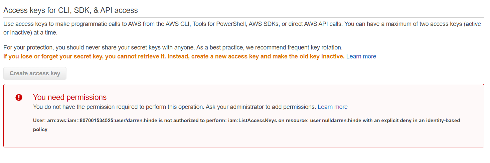
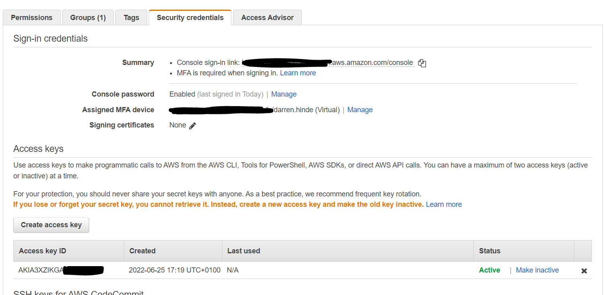

#Sign Up for AWS 
Use the following [link](https://aws.amazon.com/free/) to create a free account 

##After creating the AWS account
Create a IAM user account to limit risk. Never use your root account as commonly used account.
Use Multi factoral authentication.

To enable **Multi-factor authentication (MFA)** go to your account (top right) then go to *Security Credentials* then enable it.

--------
####Give Billing Information acess to IAM Users:
Once setup the last thing to do is enable the IAM users to see billing information. On your root account go to account page then to the **IAM User and Role Access to Billing Information** section and activate IAM see billing information. 

-----------------
##Create an IAM user account 
Go to *IAM* application, in here we will create a new policy for our new users. Select the **Policies** option

We are going to create a new policy but instead of using the gui we going to use this [code](https://docs.aws.amazon.com/IAM/latest/UserGuide/reference_policies_examples_aws_my-sec-creds-self-manage.html) made by aws to create a new policy.

We are going to use a slightly modified version of this in the form as: 

   

    Code
  

  Policy JSON Details

  ~~~ json
{
    "Version": "2012-10-17",
    "Statement": [
        {
            "Sid": "AllowViewAccountInfo",
            "Effect": "Allow",
            "Action": [
                "iam:GetAccountPasswordPolicy",
                "iam:GetAccountSummary",
                "iam:ListVirtualMFADevices",
                "iam:ListUsers"
            ],
            "Resource": "*"
        },
        {
            "Sid": "AllowManageOwnPasswords",
            "Effect": "Allow",
            "Action": [
                "iam:ChangePassword",
                "iam:GetUser"
            ],
            "Resource": "arn:aws:iam::*:user/${aws:username}"
        },
        {
            "Sid": "AllowManageOwnAccessKeys",
            "Effect": "Allow",
            "Action": [
                "iam:CreateAccessKey",
                "iam:DeleteAccessKey",
                "iam:ListAccessKeys",
                "iam:UpdateAccessKey"
            ],
            "Resource": "arn:aws:iam::*:user/${aws:username}"
        },
        {
            "Sid": "AllowManageOwnSigningCertificates",
            "Effect": "Allow",
            "Action": [
                "iam:DeleteSigningCertificate",
                "iam:ListSigningCertificates",
                "iam:UpdateSigningCertificate",
                "iam:UploadSigningCertificate"
            ],
            "Resource": "arn:aws:iam::*:user/${aws:username}"
        },
        {
            "Sid": "AllowManageOwnSSHPublicKeys",
            "Effect": "Allow",
            "Action": [
                "iam:DeleteSSHPublicKey",
                "iam:GetSSHPublicKey",
                "iam:ListSSHPublicKeys",
                "iam:UpdateSSHPublicKey",
                "iam:UploadSSHPublicKey"
            ],
            "Resource": "arn:aws:iam::*:user/${aws:username}"
        },
        {
            "Sid": "AllowManageOwnGitCredentials",
            "Effect": "Allow",
            "Action": [
                "iam:CreateServiceSpecificCredential",
                "iam:DeleteServiceSpecificCredential",
                "iam:ListServiceSpecificCredentials",
                "iam:ResetServiceSpecificCredential",
                "iam:UpdateServiceSpecificCredential"
            ],
            "Resource": "arn:aws:iam::*:user/${aws:username}"
        },
        {
            "Sid": "AllowManageOwnVirtualMFADevice",
            "Effect": "Allow",
            "Action": [
                "iam:CreateVirtualMFADevice",
                "iam:DeleteVirtualMFADevice"
            ],
            "Resource": "arn:aws:iam::*:mfa/${aws:username}"
        },
        {
            "Sid": "AllowManageOwnUserMFA",
            "Effect": "Allow",
            "Action": [
                "iam:DeactivateMFADevice",
                "iam:EnableMFADevice",
                "iam:ListMFADevices",
                "iam:ResyncMFADevice"
            ],
            "Resource": "arn:aws:iam::*:user/${aws:username}"
        },
        {
            "Sid": "DenyAllExceptListedIfNoMFA",
            "Effect": "Deny",
            "NotAction": [
                "iam:CreateVirtualMFADevice",
                "iam:EnableMFADevice",
                "iam:GetUser",
                "iam:ListMFADevices",
                "iam:ListVirtualMFADevices",
                "iam:ResyncMFADevice",
                "sts:GetSessionToken",
                "iam:ListUsers"
            ],
            "Resource": "*",
            "Condition": {
                "BoolIfExists": {
                    "aws:MultiFactorAuthPresent": "false"
                }
            }
        }
    ]
}

~~~

After copy and pasting the json policy in follow the steps and give it a descriptive name such as: **Force MFA on adminstrator accounts on AWS**

###Make A User Group
Go to group and add a Group called Admins then add policies to the group. 
The Two policies that we are going to add to this group are the **AdministratorAccess** and our newly created policy. 

###Create a new User
Go to Users -> Add user
- Create user name and password
- Add the User to the new user group

Tags can be add so users can be grouped by their tags. 

 
The User won't be able to make any new serices until he has setup a MFA account. 

Same as before add MFA device and set it up. 

Once set up relog in with MFA to get all Admin permisions

#AWS Vault 
Go to IAM -> Users -> Security Credentials -> Create Access key

Open a terminal and run 
~~~ 
aws-vault add username 
~~~
When promped set the username and secret key into aws vault

Then we need to add the MFA to our aws vault. Let's look at the settings
~~~
vi ~/.aws/config
~~~ 
Then in that file we will add the region and the Assigned MFA device number (look at picture above). 
The file should look like:

~~~
[profile darren.hinde]
region=us-east-1
mfa_serial=arn:aws:iam::XXXXXXXXXXXXX:mfa/darren.hinde
~~~

Lets test this credentials by 
~~~
aws-vault exec darren.hinde --duration=12h
~~~
Can customize the token length by adding --duration=12h

If you using windows you need to use the following: 
~~~
aws-vault exec darren.hinde --duration=12h -- cmd.exe
~~~

This console now has access to AWS with a token which we can use to deploy infastructure through terraform

-----
#Billing :dollar:
Go to My billing in the top right in AWS
Go to Budgets then choose Cost Budgets. Fill in all the nessary details. 
You can set thresholds when alert emails can be sent. 
Confirm the settings then create the budget :fire: :dollar: